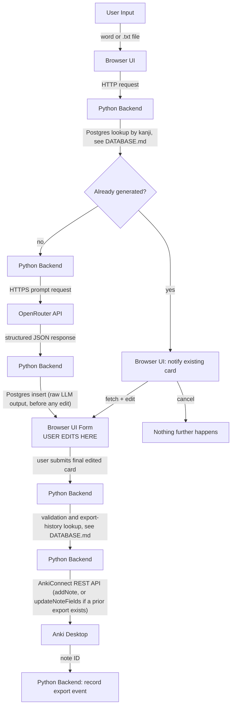

# System Architecture & Data Flow

## Card Generation & Review Workflow

### Flow Breakdown

1. **Generation Trigger:**
   - User inputs a single word or uploads a `.txt` file in the browser.
   - The browser passes the target word to the Python backend via HTTP.

2. **Duplicate Check (before any LLM call):**
   - Python looks the word up in Postgres (`words`/`cards`, see `DATABASE.md`) by kanji text.
   - **Not found:** proceed to generation (step 3) as normal- no tokens have been spent yet either way.
   - **Found:** no LLM call is made. The browser is notified the word already has a card and the user chooses to either cancel (nothing further happens) or fetch the existing card from Postgres and edit it, which rejoins the flow at step 4 below with the existing data as the starting point instead of a fresh LLM response.
   - For a batch `.txt` upload, this check runs per word before any generation: words already in Postgres are asked about one at a time exactly as above (never batched into one prompt), while only the words *not* found are sent to the LLM in step 3.

3. **LLM Execution & Parsing:**
   - Python requests structured JSON from the OpenRouter API over HTTPS, for whichever words weren't already in Postgres.
   - If response is malformed JSON, Python raises a formatting error to the browser UI.
   - As soon as a valid response comes back, Python writes it to Postgres immediately (`cards` row, write-once- see `DATABASE.md`), *before* it's shown to the user. This is what makes the persisted card always equal to the model's raw output, regardless of what happens in step 4.

4. **User Review State:**
   - Python sends the draft payload (freshly generated, or fetched from Postgres per step 2) to the browser.
   - The browser renders editable `<input>` and `<textarea>` controls pre-filled with generated fields: `[Expression, Reading, Monolingual Definition, Nuance, Synonyms, Antonyms, Example, JLPT]`.
   - The user modifies any field manually. These edits are never written back to the `cards` table- they only ever flow forward into Anki (step 5).

5. **Export:**
   - Upon clicking "Export to Anki", Python checks Postgres for a prior export of this word (`exports` table, see `DATABASE.md`).
   - **No prior export:** Python posts the finalized payload to AnkiConnect (`http://localhost:8765`) as a new note (`addNote`).
   - **Prior export exists:** Python calls AnkiConnect's `updateNoteFields` against that export's note ID instead, so the existing Anki note is rewritten rather than duplicated.
   - Either way, a successful AnkiConnect call is recorded as a new row in the `exports` table.
   - If Anki is unreachable, UI displays connection error without discarding user edits, and nothing is written to `exports`.
