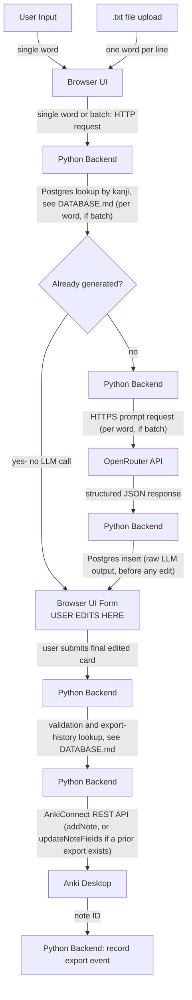

# System Architecture & Data Flow

## Card Generation & Review Workflow

### Flow Breakdown

1. **Generation Trigger:**
   - User inputs a single word or uploads a `.txt` file in the browser.
   - The browser passes the target word to the Python backend via HTTP.

2. **Duplicate Check (before any LLM call, single word and batch alike):**
   - Python looks the word up in Postgres (`words`/`cards`, see `DATABASE.md`) by kanji text **and** the requester's chosen JLPT level (a dropdown in the browser UI, falling back to `JLPT_LEVEL_DEFAULT` if unset). The same word requested at a different level is treated as not-yet-generated, since its card's language would need rewriting for the new audience. For a batch upload, this happens per word, before that word is ever handed to `generate_cards_batch()`.
   - **Not found:** proceed to generation (step 3) as normal- no tokens have been spent yet either way.
   - **Found:** no LLM call is made. Python returns the existing card straight from Postgres, and the browser shows it pre-filled with an informational banner ("This word already has a saved card- showing the existing one."). The user reviews/edits/exports it exactly like a freshly generated card, or discards it via the normal Discard button- there's no separate cancel-vs-fetch choice dialog. (A fuller notify-then-choose UX was once planned here for both flows; it was never built, and this section used to describe that unbuilt version instead of what `frontend/index.js` actually does.)
   - In a batch upload, each word is checked independently: some may come back from Postgres (no LLM call, `duplicate: true` on that word's `BatchCardResult`) while others are generated fresh in the same request, preserving the file's original order in the response. Two identical words *within the same uploaded file* are not deduped against each other- only against what's already in Postgres- since neither is persisted until after generation completes.

3. **LLM Execution & Parsing:**
   - Python requests structured JSON from the OpenRouter API over HTTPS- for whichever word(s) reach this step: a single word that wasn't already in Postgres (step 2), or every word in a batch upload regardless of Postgres state. The prompt is built with the requester's chosen JLPT level, instructing the definition/nuance/example sentence to use vocabulary and grammar suited to that level (see `PROMPTS.md`)- the word itself is still generated regardless of level, only the explanation's complexity changes.
   - If response is malformed JSON, Python raises a formatting error to the browser UI. In the batch flow, one word's failure is caught individually and doesn't abort the rest of the batch (`backend/llm.py::generate_cards_batch`)- see `ROADMAP.md`.
   - As soon as a valid response comes back, Python writes it to Postgres immediately (`cards` row, write-once content- see `DATABASE.md`), *before* it's shown to the user- for both the single-word and batch flows alike. This is what makes the persisted card always equal to the model's raw output regardless of what happens in step 4, and what gives every successfully-generated word (single or batch) a `word_id` for the export step below.

4. **User Review State:**
   - Python sends the draft payload (freshly generated, or fetched from Postgres per step 2) to the browser, along with the `word_id` Postgres assigned it.
   - The browser renders editable `<input>` and `<textarea>` controls pre-filled with generated fields: `[Expression, Reading, Monolingual Definition, Nuance, Synonyms, Antonyms, Example, JLPT]`.
   - The user modifies any field manually. These edits are never written back to the `cards` table- they only ever flow forward into Anki (step 5).

5. **Export:**
   - Upon clicking "Export to Anki", Python checks Postgres for a prior export of this word (`exports` table, see `DATABASE.md`), using the `word_id` carried alongside the card since step 3/4- single-word and batch cards both have one now.
   - **No prior export:** Python posts the finalized payload to AnkiConnect (`http://localhost:8765`) as a new note (`addNote`).
   - **Prior export exists:** Python calls AnkiConnect's `updateNoteFields` against that export's note ID instead, so the existing Anki note is rewritten rather than duplicated.
   - Either way, a successful AnkiConnect call is recorded as a new row in the `exports` table.
   - If Anki is unreachable, UI displays connection error without discarding user edits, and nothing is written to `exports`.

## Chrome Extension Flow (no review step)

The extension (`extension/`) skips step 4 above entirely. It calls a single combined endpoint, `POST /generate/export`, which internally runs the same duplicate-check (step 2) and LLM/persistence (step 3) logic, then immediately does the export (step 5) against the freshly generated or Postgres-fetched card- no editable form, no user-in-the-loop step between generation and Anki. The endpoint streams back one terminal NDJSON event: `"exported"` on success, or `"error"` with a `stage` of `"generate"` (nothing new persisted) or `"export"` (card generated and saved to Postgres, but the AnkiConnect call failed- recoverable via the web app's ordinary duplicate-word path, since re-generating the same word there will find it already on file). The extension's background service worker can have several of these requests in flight at once, each independent, and shows a desktop notification per outcome. See `extension/README.md`.
